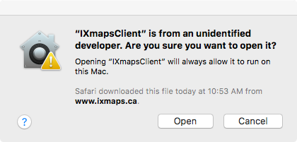
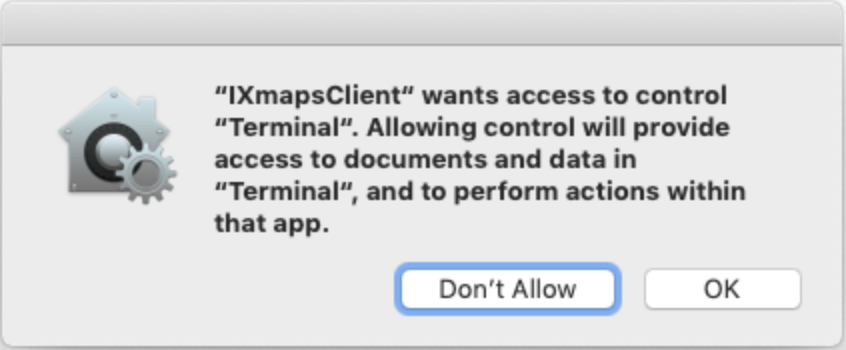

# IXmaps Client
Version 1.1.1 released Dec 16, 2019

**IXmapsClient** is an internet mapping tool that allows you to see how your personal data travels across the internet. It works by generating traceroutes to determine the paths your data packets take. These contributions are submitted to the ixmaps.ca server, where they are visualized geographically for public display and analysis.

**IXmapsClient** sets up a local web server that only answers queries from your device, then opens a browser page to access the interface via port 2040.

The current version of the client can be downloaded from [www.ixmaps.ca/contribute](https://www.ixmaps.ca/contribute.php).

### Installation
This version of the software has been tested and runs on Mac OS X:
* 10.10
* 10.11
* 10.12
* 10.13
* 10.14

Note: If you have previously installed a version of the **IXmapsClient**, you must remove it before proceeding (see below for uninstall instructions).

1. Download the IXmapsClient installer **IXmapsClient.1.1.1.macos.dmg**
2. Double click on the **IXmapsClient.1.1.1.macos.dmg** to open it
3. Drag the **IXmapsClient.app** application to your **Applications** folder
4. Double click on **IXmapsClient.app** to launch

IXmapsClient for macOS is not signed with an Apple Developer ID and macOS [Gatekeeper](https://support.apple.com/HT202491) security settings will not allow it to be started. To bypass Gatekeeper one time for IXmapsClient, control-click or right-click on the **IXmapsClient.app** icon and choose **Open** from the context menu. This will display the following dialog: 

Click the **Open** button to run launch the **IXmapsClient.app** application.

**IXmapsClient** needs to be executed in a terminal with administrator's privileges. When double clicking **IXmapsClient.app**, you will be asked to allow it access to Terminal.

Click ok to proceed, and a new terminal window will be opened. You will then be asked for the administrator's password; enter your admin password to proceed. The **IXmapsClient** interface should appear in your browser, or use your browser to go to [http://localhost:2040/](http://localhost:2040/).

#### Removing **IXmapsClient**
Move the **IXmapsClient.app** application from your **Applications** folder to the Trash. This will completely remove the **IXmapsClient** from your computer.

## Contributors
* David H. Mason - independent software developer
* Andrew Clement - Faculty of Information, University of Toronto
* Antonio Gamba-Bari - Faculty of Information, University of Toronto
* Colin McCann - Faculty of Information, University of Toronto
* Dawn Walker - Faculty of Information, University of Toronto

## License
Copyright (C) 2020 IXmaps.
**IXmapsClient** and the repository [github.com/ixmaps/IXmapsClient](https://github.com/ixmaps/IXmapsClient) are licensed under a GNU AGPL v3.0 license. This program is free software: you can redistribute it and/or modify it under the terms of the GNU General Public License as published by the Free Software Foundation, version 3 of the License.

This program is distributed in the hope that it will be useful, but WITHOUT ANY WARRANTY; without even the implied warranty of MERCHANTABILITY or FITNESS FOR A PARTICULAR PURPOSE. See the GNU General Public License for more details.

You should have received a copy of the GNU General Public License along with this program.  If not, see [gnu.org/licenses](https://gnu.org/licenses/agpl.html).
